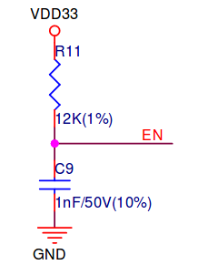
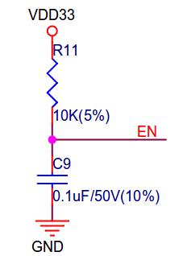

PROTOTYPE ERRATA
================

## Hardware errata

### 1. GPS pins swapped

GPS pins(TX-(GPIO15) and RX-(GPIO36/VPN)) are swapped fromthe PCB design stage hence affecting the PCB produced. The effect is that GPIO36/VPN is input only and can't be used for TX to send commands to the GPS module.

#### Workaround

Swap the two TX UART connections and set the setup and RX only. This enables the NMEA messages to still be received but commands can't be sent.

### 2. DHT22 Temperature/Humidity sensor on input only pin

The DHT22 sensor which relies on the Dallas one wire protocol has been setup on an input only pin. The effect is that the module is unable to start up as the microcontroller is supposed to toggle the line in push pull mode in order to signal a start of frame.

#### Workaround

There is currently no workaround for this in software unless the pin that it is connected is set as an input and is connected to a pin with output capability that is not being used by the LAN module due to errata 3.

### 3. LAN module reference oscillator line pulling GPIO0 low on boot

The LAN module is pulling GPIO 0 low on boot. This is regardless of no power(Below minimum VDD) is supplied due to the 3.3v regulator being disabled via its enable pin. The board works as normal without the module attached.

#### Workaround

Currently there is no workaround for this. A probable solution may be to pull the clock enable line low, but it is not known how this may affect the output impedance of the oscillator in the absence of power.

### 4. Unable to send downlink for class A devices using a cellular backhaul

The time the downlink packet is received back is ~1.5 seconds after the uplink packet transmission. This exceeds the asynchronous RX1 window that is open 1 second after uplink.

#### Workaround

Untested.Probably use the RX2 window that is open 2 seconds after uplink.

### 5. Failure to start SPI boot during normal operation.

The ESP32 fails to  start as above. It is noted that GPIO2 must be pulled down to start SPI boot butit is an output due to the SCK function. Also GPIO5 is connected to an output(RESET line). MTDO(GPIO15) must be pullup and is connected to the TX line from the GPS and MTDI(GPIO 12 must be pullup). his is left open as is as it is shared with the flash chip.

It is noted that the boot-mode is 0x30 when it waits on download boot and 0x13 on fast spi boot. This is only in the V4 devkit-C and not on the earlier version 2 core board. The errata number 3 of the ethernet module affects all the two boards.

DEVKIT-C version 2: Risetime 12us

DEVKIT-C version 4: Risetime 1ms

#### Workaround

Boot first and when it is noted the ESP32 is not booting, reset the system. There may also be pulldown reistors present on any of the lines such as that from the GPS. In next design iteration, set these pins as outputs even if they are not the cause directly.

Using an earlier verion 2 board is not a feasible suggestion as a workaround.

### 6. ESP32 DEVKIT-C pin width in footprint incorrect.

The ESP32 footprint pin to pin width is set to 0.9 inches, this is 0.1 inch from the actual at 1.0 inch.

#### Workaround
Fix the footprint prior to the next revision and bend the mounting female pins if using them for the current.

### 7. ESP32 pin pad hole dia, LAN module pin pad hole dia and for any staggered through hole footprint made by hand is too large to hold the component pin socket.

It looks like sockets require a smaller hole diameter. Due to the effect of reducing the hole diameter affecting the placement of the component, if desired, without soldering. This should not be reduced.

#### Workaround
Solder pin sockets first on the board as they will not be held by the staggered pins. Placement of the sockets must be soldered. Components direcctly placed need not be soldered. The adjacent pin offset from the centerline can be left at 0.8mm as is in the current design.

### 8. Wrong pin assignment in footprint for the RAK831

Looks like the footprint was flipped from top vertical view to a bottom vertical view in the current design.

#### Workaround
TODO: Insert image of work around as implemented.

## Software errata

### 1. Time drift affecting downlink

SNTP fails to be fetched even after the 10 retries.

#### Workaround

Form a task that fetches SNTP time from the time servers after every so often instead of just at start incase it fails to obtain SNTP time at start. How often is a function of drift of RTC time from the ESP32 time. As per this: https://github.com/espressif/esp-idf/issues/769 , the unit to use forworst case crystals is 20ppm thus we update the clock per 500second interval for a maximum drift of 10ms in order not to to have a deviation of 1s +/- 10ms of the downlink RX1 window.